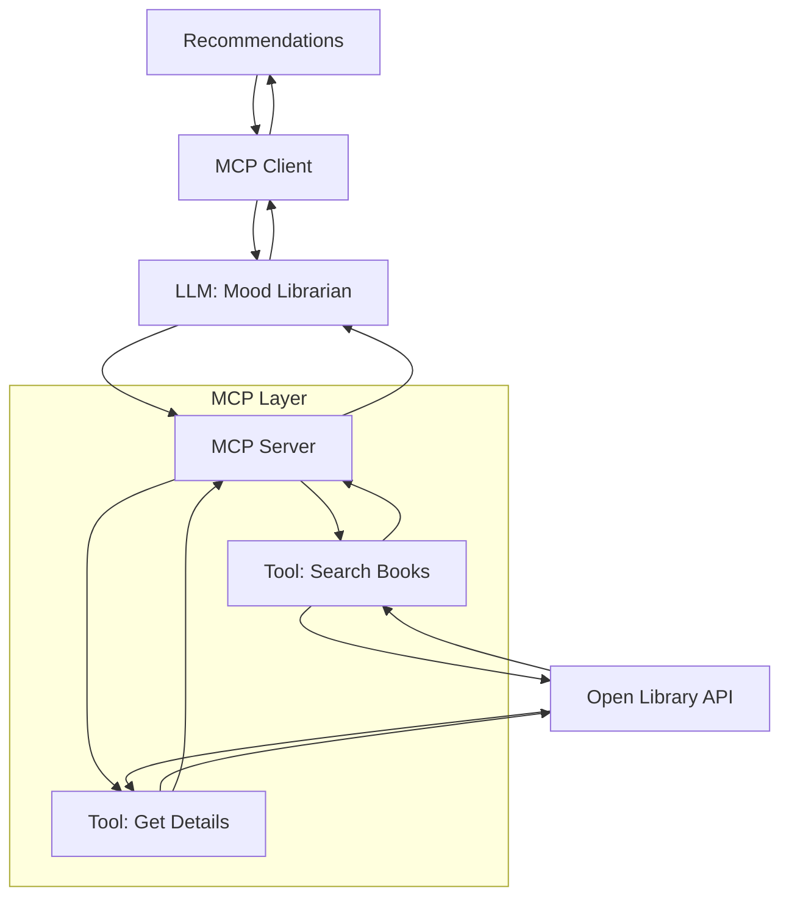
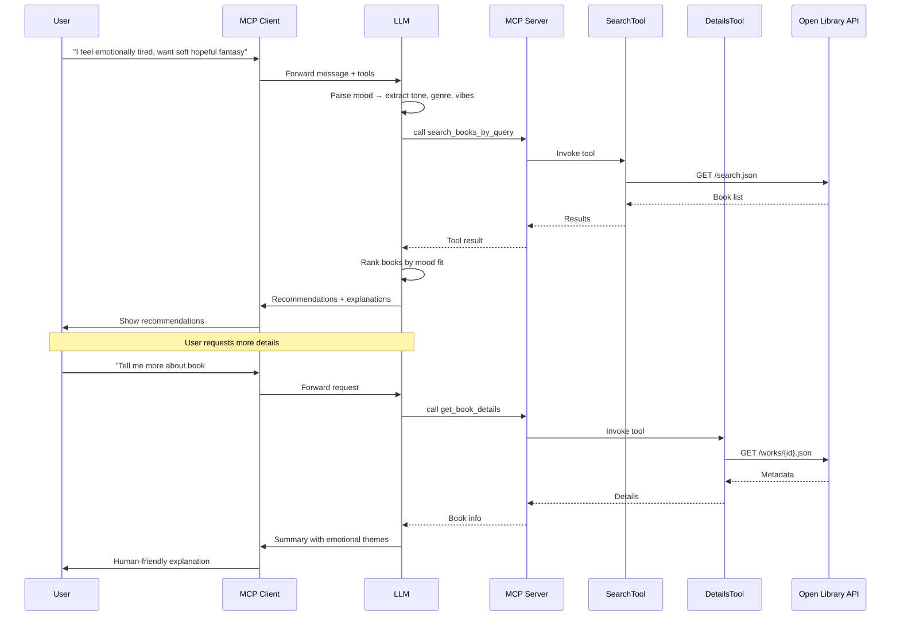
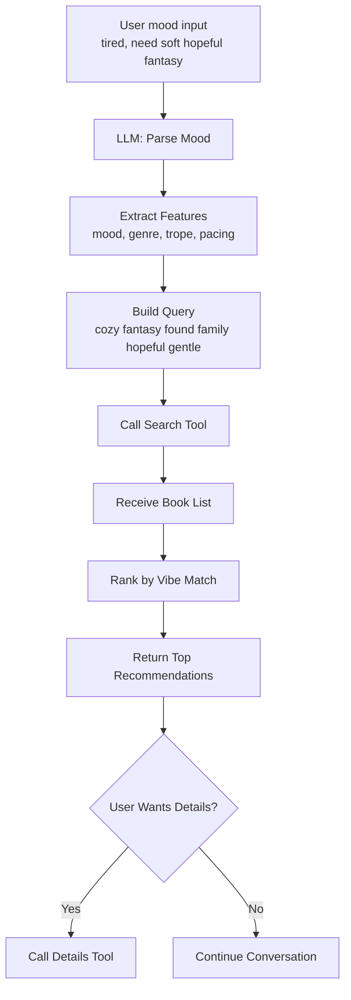
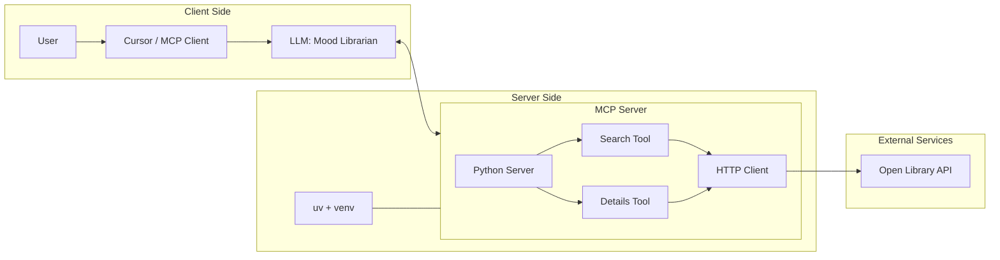
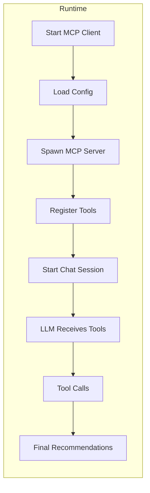

# 📚 MoodReads — MCP-Powered Mood-Based Book Recommender

> _"Tell me how you feel, and I'll find the story that matches your heart."_

MoodReads is an **MCP-based AI agent** that recommends books based on your **current mood and vibes**, not just genre keywords.

You say things like:

> _"I feel emotionally tired and want a soft hopeful fantasy with found family."_

The system:

1. Interprets your mood,
2. Builds a smart search query,
3. Calls MCP tools to the **Open Library API**,
4. Ranks and explains recommendations,
5. Optionally fetches detailed info for any book you pick.

---

## 🧭 High-Level Project Overview

- **Interface**: You chat from an MCP-enabled client (e.g. Cursor).
- **Brain**: An LLM acting as a "Mood Librarian".
- **Tools** (MCP):
  - `search_books_by_query(query, limit)` → finds candidate books from Open Library.
  - `get_book_details(book_id)` → fetches rich metadata, description, subjects, etc.
- **Source of Truth**: Open Library's free, public book catalog API.
- **Goal**: Map **emotions + vibes → story suggestions** in a transparent, tool-driven, reproducible way.

---

## 🧩 System Architecture


## 🔁 End-to-End Request Flow



## 🔍 Internal Flow: Mood → Query → Tools


## 🧠 Tools Overview
🔎 search_books_by_query
Signature:

```python
async def search_books_by_query(query: str, limit: int = 5) -> Dict[str, Any]
Used by the LLM to search Open Library using a mood/genre/trope-rich string.
```
Example return:

```json
{
  "query": "cozy fantasy found family hopeful",
  "total_found": 123,
  "books": [
    {
      "id": "/works/OL22082778W",
      "title": "Heartsong",
      "author": "T.J. Klune",
      "first_publish_year": 2019,
      "subjects": ["Fantasy", "Romance", "LGBTQ+", "Found family"],
      "edition_count": 12
    }
  ]
}
```
📖 get_book_details
Signature:

```python
async def get_book_details(book_id: str) -> Dict[str, Any]
Takes the id returned by search_books_by_query (e.g. /works/OL22082778W) and fetches rich metadata from the Open Library works API.
```
Example return:

```json
{
  "id": "/works/OL22082778W",
  "title": "Heartsong",
  "description": "A cozy, found-family fantasy...",
  "subjects": ["Fantasy", "Queer", "Friendship", "Found family"],
  "first_publish_date": "2019",
  "covers": [1234567],
  "links": [],
  "raw": { "full Open Library payload" }
}
```
## 🧱 Component Architecture


## ⚙️ Runtime View



## 🛠 Tech Stack
```markdown

| Layer              | Technology                           |
|--------------------|--------------------------------------|
| AI Orchestration   | MCP (Model Context Protocol)         |
| Agent Client       | Cursor (MCP-enabled IDE)             |
| Backend            | Python, FastMCP                      |
| HTTP Client        | httpx                                |
| Book Catalog       | Open Library API                     |
| Environment        | uv + virtualenv (.venv)              |


```

## 🚀 Quick Start
1. Clone & Install
```bash
git clone https://github.com/your-username/moodreads-mcp.git
cd moodreads-mcp
```
2. Run MCP Server (for dev / inspector)
```bash
uv run mcp dev src/mood_reads_server.py
# Opens MCP Inspector where you can test both tools
```
3. Configure in Cursor (MCP)
In Cursor MCP settings:
```json
{
  "mcpServers": {
    "mood-reads": {
      "command": "C:/path/to/.venv/Scripts/python.exe",
      "args": [
        "C:/path/to/repo/src/mood_reads_server.py"
      ]
    }
  }
}
```
## 💡 Example Prompts
```
"I feel drained and need something gentle, soft, and warm with found family."

"Give me dark academia with mystery and slow-burn romance."

"Tell me more about the first book you recommended; fetch detailed info."
```

## 🗺 Roadmap
```
User preference learning (remember what you liked)

Scoring & ranking model for better match quality

Web UI or Streamlit app

Integration with other book APIs (Goodreads/StoryGraph style)
```

## 📝 License
```
MIT — free to use, modify, and extend.
```

## ❤️ Credits
```
Open Library for book metadata.

MCP ecosystem for tool-based AI patterns.
```

